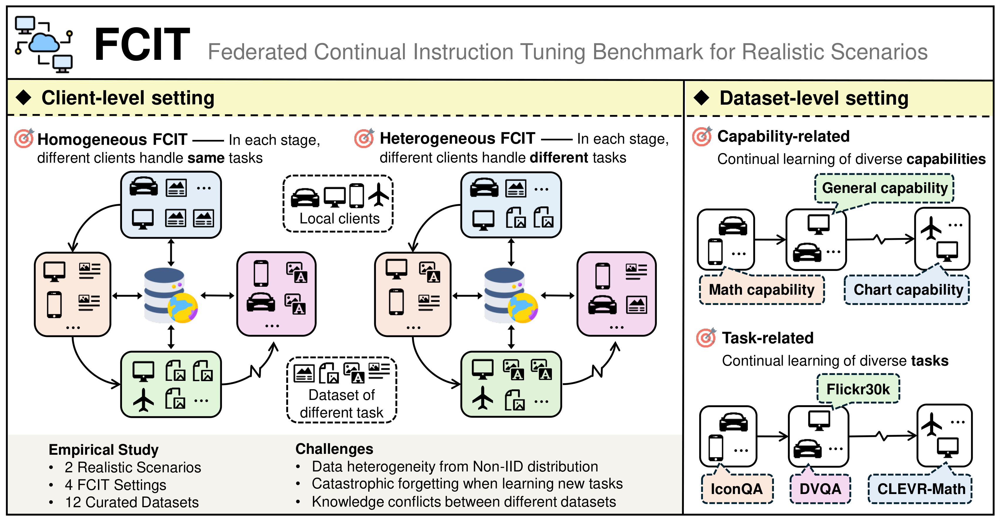

# 🎸 Federated Continual Instruction Tuning (ICCV 2025)

[](https://huggingface.co/datasets/MLLM-CL/FCIT)  [](https://arxiv.org/pdf/2503.12897)

This repo is the official implementation of ICCV 2025 paper: **[Federated Continual Instruction Tuning](https://arxiv.org/pdf/2503.12897)**

> Federated Continual Instruction Tuning
>
> Haiyang Guo, Fanhu Zeng, Fei Zhu, Wenzhuo Liu, Da-Han Wang, Jian Xu, Xu-Yao Zhang, Cheng-Lin Liu



## News

- **[2025.06.25]** **FCIT** has been accepted by **ICCV 2025**! :tada:

## Abstract

A vast amount of instruction tuning data is crucial for the impressive performance of Large Multimodal Models (LMMs), but the associated computational costs and data collection demands during supervised fine-tuning make it impractical for most researchers. Federated learning (FL) has the potential to leverage all distributed data and training resources to reduce the overhead of joint training. However, most existing methods assume a fixed number of tasks, while in real-world scenarios, clients continuously encounter new knowledge and often struggle to retain old tasks due to memory constraints. In this work, we introduce the Federated Continual Instruction Tuning (FCIT) benchmark to model this real-world challenge. Our benchmark includes two realistic scenarios, encompassing four different settings and twelve carefully curated instruction tuning datasets. To address the challenges posed by FCIT, we propose dynamic knowledge organization to effectively integrate updates from different tasks during training and subspace selective activation to allocate task-specific output during inference. Extensive experimental results demonstrate that our proposed method significantly enhances model performance across varying levels of data heterogeneity and catastrophic forgetting.

## Installation

The installation of our environment is the same as [CoIN](https://github.com/zackschen/CoIN) and [HiDe-LLaVA](https://github.com/Ghy0501/HiDe-LLaVA).

```bash
conda create -n FCIT python=3.10 -y
conda activate hide
pip install --upgrade pip
pip install -e .
pip install -e ".[train]"
pip install flash-attn --no-build-isolation
```

To measure the metrics of caption tasks, please install the following three packages:

```bash
pip install nltk==3.9.1
pip install pycocotools==2.0.8
pip install pycocoevalcap==1.2
```
We recommend replacing the eval.py file under that path `/envs/FCIT/lib/python3.10/site-packages/pycocoevalcap/` in your environment with the eval.py file that we have provided in the repository to avoid unwanted error reporting and time overhead.


Technical issues can be reported and addressed through the official GitHub issue trackers for both projects: [CoIN](https://github.com/zackschen/CoIN) and [LLaVA](https://github.com/haotian-liu/LLaVA).

## FCIT Benchmark

Please download the images from the constituting dataset：

|Image Source | Download Path|
| :-: | :-: |
|ArxivQA|[images](https://huggingface.co/datasets/MMInstruction/ArxivQA/tree/main)|
|ImageNet-R|[images](https://huggingface.co/datasets/HaiyangGuo/UCIT/tree/main/UCIT/ImageNet-R)|
|IconQA|[images](https://iconqa.github.io/)|
|CLEVR-Math|[images](https://huggingface.co/datasets/dali-does/clevr-math/tree/main)|
|super-CLEVR|[images](https://github.com/Lizw14/Super-CLEVR)|
|Flickr30k|[images](https://huggingface.co/datasets/HaiyangGuo/UCIT/tree/main/UCIT/Flickr30k)|
|DVQA|[images](https://huggingface.co/datasets/MLLM-CL/FCIT/tree/main/dataset)|
|Grounding, AOKVQA|[train](http://images.cocodataset.org/zips/train2014.zip) [val](http://images.cocodataset.org/zips/val2014.zip) [test](http://images.cocodataset.org/zips/test2014.zip)|
|OCR-VQA|[images](https://drive.google.com/drive/folders/1_GYPY5UkUy7HIcR0zq3ZCFgeZN7BAfm_)|
|TabMWP|[images](https://github.com/lupantech/PromptPG)|
|FigureQA|[images](https://huggingface.co/datasets/MLLM-CL/FCIT/tree/main/dataset)|

After downloading all of them, organize the data as follows:
```
|-- datasets
    |-- ArxivQA
        |-- images/
    |-- CLEVR
        |-- images
            |-- train/
            |-- test/
            |-- val/
    |-- Flickr30k
        |-- train/
        |-- val/
    |-- IconQA
        |-- iconqa_data/
            |-- iconqa/
    |-- ImageNet-R
        |-- train/
        |-- test/
    |-- COCO2014
        |-- train2014/
        |-- test2014/
        |-- val2014/
    |-- super-CLEVR
        |-- images/
    |-- FigureQA
        |-- images/
    |-- OCR-VQA
        |-- images/
    |-- DVQA
        |-- images/
    |-- TabMWP
        |-- tables/
```

Please download the `instructions` and `partitioned_data` from our [HuggingFace](https://huggingface.co/datasets/HaiyangGuo/UCIT) page, then, organize the instructions as follows:
```
|-- instructions
    |-- ArxivQA
    |-- CLEVR-Math
    |-- Flickr30k-cap
    |-- IconQA
    |-- ImageNet-R
    |-- super-CLEVR
    |-- DVQA
    |-- FigureQA
    |-- Grounding
    |-- OCRVQA
    |-- AOKVQA
    |-- TabMWP
|-- partitioned_data
    |-- Capability-related
        |-- cap
    |-- Task-related
        |-- seq
```

## Pre-trained Weights

Please download [LLaVA](https://huggingface.co/liuhaotian/llava-v1.5-7b) and [CLIP](https://huggingface.co/openai/clip-vit-large-patch14-336), and use the **config.json** provided in this repository replace the original config.json in LLaVA.

## Training and Evaluation

The training script is in `scripts/LLaVA/Train_FCIT.../train_all.sh`. Before running, please do not forget to **modify the path** in the files to your actual path.

e.g., Task-related Homogeneous FCIT setting with beta=1.0
``` 
sh scripts/LLaVA/Train_FCIT_task_hom/train_all.sh 1.0
```

The evaluation script is in `scripts/LLaVA/Eval_FCIT/`. Before running, please do not forget to **modify the path** in the files to your actual path.

e.g., Task-related Homogeneous FCIT setting with beta=1.0
``` 
sh scripts/LLaVA/Eval_FCIT/Eval_FCIT_task_hom.sh 1.0
```

## Citation

```bibtex
@article{guo2025federated,
  title={Federated continual instruction tuning},
  author={Guo, Haiyang and Zeng, Fanhu and Zhu, Fei and Liu, Wenzhuo and Wang, Da-Han and Xu, Jian and Zhang, Xu-Yao and Liu, Cheng-Lin},
  journal={arXiv preprint arXiv:2503.12897},
  year={2025}
}
```

## Acknowledgememnt

This repository is built upon the [LLaVA](https://github.com/haotian-liu/LLaVA), [CoIN](https://github.com/zackschen/CoIN), [Shepherd](https://github.com/JayZhang42/FederatedGPT-Shepherd), and [OpenFedLLM](https://github.com/rui-ye/OpenFedLLM) projects. We sincerely thank the authors for their valuable contributions to the research community.
